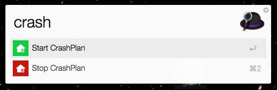

CrashPlan Control
=================
Provides an easy way to control CrashPlan service with Alfred.

## Getting Started

You can download this with [packal](https://github.com/packal/repository/raw/master/org.kollectiv.crashPlan/crashplancontrol.alfredworkflow) for easy updates or directly from [here](https://github.com/gilbarbara/crashplan-control/raw/master/CrashPlanControl.alfredworkflow).
